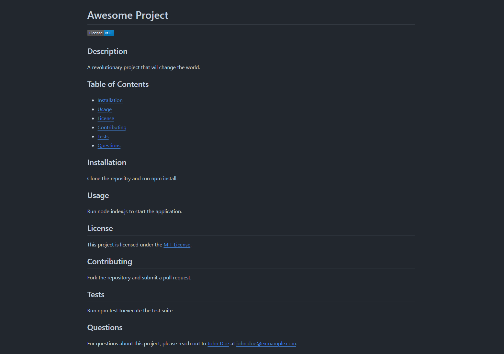

<div align="center">

# README Wizard

[](https://opensource.org/licenses/MIT)


 
 

</div>

## Desciption 

README Wizard is a simple command-line task management tool that allows users to add, delete, and list tasks easily from their terminal. Designed with productivity in mind, README Wizard helps keep track of your tasks without the overhead of a GUI-based application.

## Table of Contents

- [Description](#description)
- [Installation](#installation)
- [Usage](#usage)
- [Features](#features)
- [Contributing](#contributing)
- [Tests](#tests)
- [License](#license)


## Installation

Before you can run README Wizard, you need to ensure that Node.js and npm (Node Package Manager) are installed on your system. If you don't already have Node.js and npm installed, you can download and install them from Node.js official website. This installation will include npm by default.

<b>Installing Node.js and npm</b>
1.  Go to https://nodejs.org/.
2.  Download the version appropriate for your system (Windows, Mac, Linux).
3.  Run the installer and follow the prompts to install Node.js and npm.

To verify the installation, open a terminal or command promt and type: 

```
node -v
```

```
npm -v
```

This will display the version of Node.js and npm installed on your system, confirming that the installation was successful.

```
node --version
```

```
npm --version
```
<b>Setting Up README Wizard</b>

After installing Node.js and npm, you can set up README Wizard:


Clone the repository to your local machine: 
```
git clone https://github.com/haartmuhn/readme-wizard.git
```

Navigate to the project directory:
```
cd readme-wizard
```

Install necessary Node.js packages:

```
npm install
```

## Usage

To use README Wizard, run the following command from the root of your project directory:

```
node index.js
```

The following video shows the web application's functionality: 

<div align="center">

https://github.com/haartmuhn/readme-wizard/assets/164945655/a3d92d7f-0aea-4e65-b13f-d3b574ea8cb2


The following image shows the web appearance:



</div>

## Features

- <b>Add Tasks:</b> Quickly add tasks to your list with a simple command.
- <b>Delete Tasks:</b> Remove tasks from your list once completed.
- <b>List Tasks:</b> View all current tasks in a neatly formatted list.
- <b>Persistent Storage:</b> Tasks are saved in a local file, ensuring they persist between sessions.

## Contributing

Contributions to README Wizard are always welcome, whether they involve bug fixes, improvements, or new features. We adhere to the Contributor Covenant code of conduct. Here’s how you can contribute:

1.  Fork the repository on GitHub.
2.  Clone your fork to your local machine.
3.  Create a new branch for your changes.
4.  Make your changes and test them.
5.  Submit a pull request with a clear description of the improvements.

Please ensure your code adheres to the existing style, and include updates to documentation and tests as needed.

## Tests

README Wizard comes with a series of unit tests to ensure functionality remains consistent and reliable through updates. You can run these tests using the following command:

```
npm test
```

Here's an example of what the a test might look like: 

```
> static-site@1.0.0 test
> echo "Error: no test specified" && exit 1

"Error: no test specified"
```
- echo "Error: no test specified": This part echoes the message "Error: no test specified" to the console.
- &&: This operator is used to chain commands in a script. In this case, it means "if the previous command succeeds, then execute the next command."
- exit 1: This command exits the script with an exit code of 1. An exit code of 1 typically indicates an error or failure.

So, when you run npm test, it will simply print "Error: no test specified" to the console and exit with code 1, indicating that no tests have been defined. 

## License 

[MIT License](https://opensource.org/licenses/MIT)